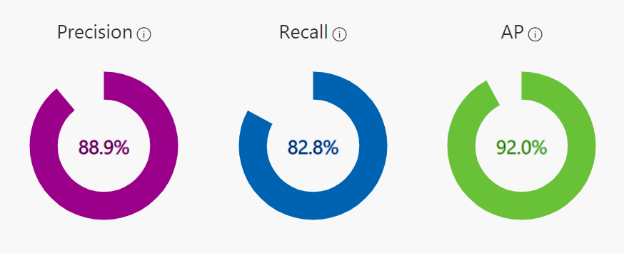
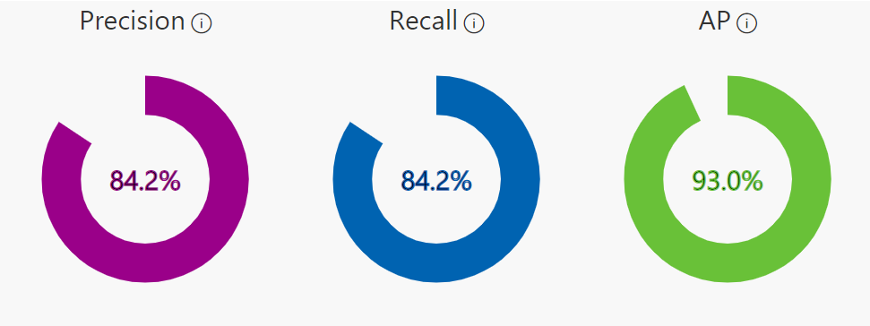
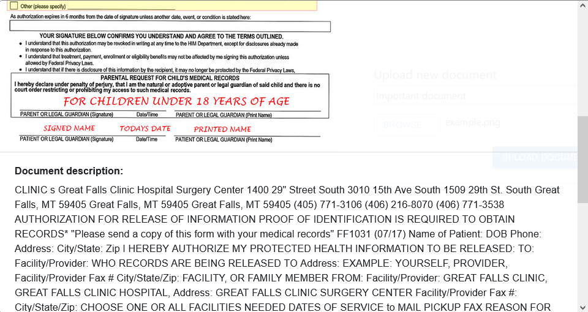

# Healthcare App for Millennials

- [Healthcare App for Millennials](#healthcare-app-for-millennials)
  - [Description](#description)
  - [Contributors](#contributors)
  - [Tech Stack](#tech-stack)
  - [Architecture](#architecture)
  - [Overview](#overview)
  - [User Guide](#user-guide)
  - [Demo](#demo)
  - [Templates](#templates)
    - [Cognitive Services](#cognitive-services)
    - [Computer Vision](#computer-vision)
    - [Custom Vision](#custom-vision)
    - [Custom Vision Prediction](#custom-vision-prediction)
    - [Container Registry](#container-registry)
    - [Container Instances](#container-instances)
    - [App Service](#app-service)
  - [Sources](#sources)

## Description

The goal of the project was to create an app that would:

- store medical documentation and convert it into plain text
- store X-ray images and detect diseases

## Contributors

- Damian Janczarek - [github](https://github.com/janczarek99)
- Tomasz Stańczuk - [github](https://github.com/TommyV2)
- Monika Kusiak - [github](https://github.com/KitsunesWrath)
- Michał Gajda - [github](https://github.com/michauga)
- Hubert Piłka - [github](https://github.com/MrBallOG)
- Joanna Koła - [github](https://github.com/Jannixen)

## Tech Stack

- React
- Python (FastAPI)
- Docker
- NGINX
- Azure App Service
- Azure Container Services:
  - Container Instances
  - Container Registry
- Azure Virtual Machines
- Azure Database for PostgreSQL
- Azure Blob Storage
- Azure Cognitive Services:
  - Azure Computer Vision (OCR)
  - Azure Custom Vision (Multiclass Classification)

## Architecture

## Overview

The Core of our app are Cognitive Services, namely Computer Vision and Custom Vision. The former is used for converting images containing medical documentation into plain text. The latter detects one of 3 arbitrarily chosen diseases (brain tumor, lung cancer, pneumonia) based on X-ray images. While Computer Vision works out of the box, Custom Vision models had to undergo machine learning process. Used datasets can be found [here](#sources). Some of the images used:

Training results:

Both services were published in form of an API.

Communication with them is orchestrated by yet another API, written in Python using FastAPI Framework. It also exchanges information with two other Azure Services - Database for PostgreSQL and Blob Storage. The latter stores uploaded documentation and images, the former links to that data, user accounts and results returned by Cognitive Services (extracted text, predictions). API was published in form of a docker container, built with Container Registry and deployed through Container Instances.

In order to make app more secure and allow for encrypted communication, backend was put behind a NGINX reverse proxy running on a Ubuntu Virtual Machine.

For user-system interaction a web app was created, written in React, deployed through App Service.

## User Guide

First of all user has to create an account so uploaded data can be linked to them:

Then either documents or diagnosis can be chosen:

Choosing the first option displays screen below. On the left we have all uploaded documents and on the right we can add a new one.

Clicking on document shows itself and data extracted from it:

Choosing diagnosis displays a very similar screen with one difference - a radio button that informs backend which of three models should be chosen in order to detect the disease.

Clicking on image shows itself and suggestion about steps that should be taken:

Link to the website - <https://healthcare-for-millennials-frontend.azurewebsites.net>

## Demo

## Templates

Below you can find buttons for quick deployment of services used in this app using ARM (Azure Resource Manager) templates. All templates and their parameters can be found [here](resources/azure-deploy-templates/).

### Cognitive Services

### Computer Vision

### Custom Vision

### Custom Vision Prediction

### Container Registry

### Container Instances

### App Service

## Sources

- <https://www.kaggle.com/mohamedhanyyy/chest-ctscan-images>
- <https://www.kaggle.com/navoneel/brain-mri-images-for-brain-tumor-detection>
- <https://www.kaggle.com/paultimothymooney/chest-xray-pneumonia>
